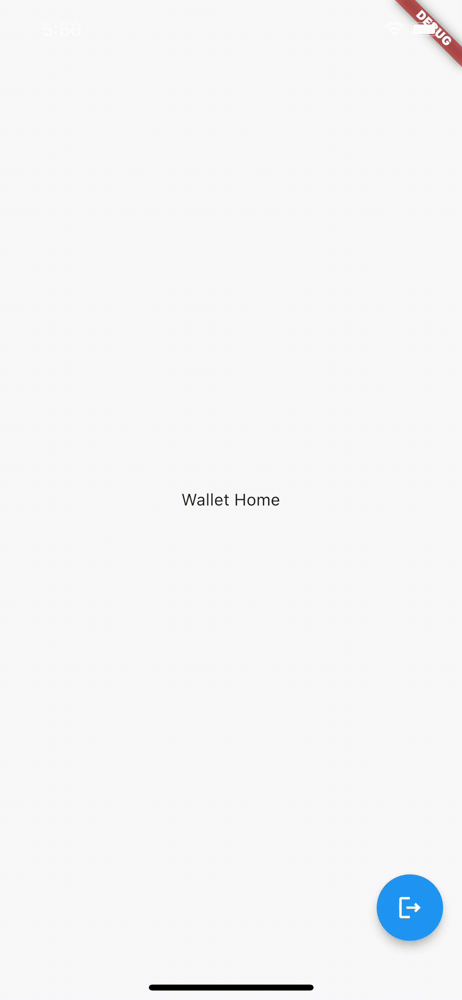

## Login Check - Module App


* Check if the *user* is *new user* or *existing user* and re-direct to *WalletHome* or *LoginHome* the pages accordingly
* Enable the *user* to *logout* of the app

---------------------------------


---------------------------------




----------------------------------

**MaterialApp()**

```dart
class MyApp extends StatelessWidget {
  const MyApp({Key? key}) : super(key: key);

  // APPLICATION STARTS HERE;
  @override
  Widget build(BuildContext context) {
    return MaterialApp(
      home: const LoginCheck(),
    );
  }
}
```

**LoginCheck()**

```dart
class LoginCheck extends StatefulWidget {
  const LoginCheck({Key? key}) : super(key: key);

  @override
  State<LoginCheck> createState() => _LoginCheckState();
}

class _LoginCheckState extends State<LoginCheck> {
  SharedPreferences? userCredentials;
  String isNewuser = "yes";

  getUserCredentials() async {
    print("****getUserCredentials()****");

    userCredentials = await SharedPreferences.getInstance();
    isNewuser = (userCredentials!.getString('isnewuser') ?? "yes");

    if (isNewuser == "no") {
      Navigator.pushReplacement(context, MaterialPageRoute(builder: (context) {
        return WalletHome();
      }));
    }
    if (isNewuser == "yes") {
      (userCredentials!.setString('isnewuser', 'yes'));

      Navigator.pushReplacement(context, MaterialPageRoute(builder: (context) {
        return LoginHome();
      }));
    }
  }

  @override
  void initState() {
    print("****Login-Check****");
    super.initState();
    getUserCredentials().whenComplete(() {
      print("****getUserCredentials-completed!****");
    });
  }

  @override
  Widget build(BuildContext context) {
    return Scaffold(
      appBar: AppBar(
        title: Text("Login Check"),
      ),
      body: Center(
        child: Column(
          mainAxisAlignment: MainAxisAlignment.center,
          children: [
            Container(
                color: Colors.yellow, child: Text("isNewuser: $isNewuser")),
            Text("Connecting..."),
          ],
        ),
      ),
    );
  }
}
```

**LoginHome()**

```dart
class LoginHome extends StatefulWidget {
  LoginHome({Key? key}) : super(key: key);

  @override
  State<LoginHome> createState() => _LoginHomeState();
}

class _LoginHomeState extends State<LoginHome> {
  SharedPreferences? userCredentials;

  var isNewuser;

  getUserCredentials() async {
    userCredentials = await SharedPreferences.getInstance();
    setState(() {
      isNewuser = (userCredentials!.getString('isnewuser'));
    });
  }

  @override
  void initState() {
    getUserCredentials();
  }

  @override
  Widget build(BuildContext context) {
    return Scaffold(
      appBar: AppBar(
        title: Text("Login Check"),
      ),
      body: Center(
        child: Column(
          mainAxisAlignment: MainAxisAlignment.center,
          children: <Widget>[
            Container(
                color: Colors.yellow,
                child: Text("isNewuser:" + isNewuser.toString())),
            Padding(
              padding: const EdgeInsets.all(8.0),
              child: ElevatedButton(
                child: Text(
                  'Create Wallet',
                ),
                onPressed: () async {
                  userCredentials = await SharedPreferences.getInstance();
                  userCredentials!.setString('isnewuser', "no");
                  var temp = (userCredentials!.getString('isnewuser'));
                  print(temp);

                  Navigator.pushReplacement(context,
                      MaterialPageRoute(builder: (context) {
                    return WalletHome();
                  }));
                },
              ),
            ),
            Padding(
              padding: const EdgeInsets.all(8.0),
              child: ElevatedButton(
                child: Text(
                  'Restore Wallet',
                ),
                onPressed: () async {
                  userCredentials = await SharedPreferences.getInstance();

                  userCredentials!.setString('isnewuser', "no");

                  Navigator.pushReplacement(context,
                      MaterialPageRoute(builder: (context) {
                    return WalletHome();
                  }));
                },
              ),
            ),
          ],
        ),
      ), // This trailing comma makes auto-formatting nicer for build methods.
    );
  }
}
```

**WalletHome()**

```dart
class WalletHome extends StatelessWidget {
  WalletHome({Key? key}) : super(key: key);

  SharedPreferences? userCredentials;

  @override
  Widget build(BuildContext context) {
    return Scaffold(
      body: Center(child: Text("Wallet Home")),
      floatingActionButton: FloatingActionButton(
        child: Icon(Icons.logout_outlined),
        onPressed: () async {
          userCredentials = await SharedPreferences.getInstance();

          userCredentials!.setString('isnewuser', "yes");

          Navigator.pushReplacement(context,
              MaterialPageRoute(builder: (context) {
            return LoginCheck();
          }));
        },
      ),
    );
  }
}
```
